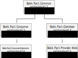

Pact for dotnet core
====================

This is a tool for building consumer driven test 
using the [Pact](https://docs.pact.io/) protocol.
This facilitates *consumers* of services to define their expectation of the service (the *provider*) 
in trhe form of a contract. This contract is called a pact.

Read more about Pact at https://docs.pact.io/ and at the [Ruby implementation repo](https://github.com/realestate-com-au/pact).
The [specs are found here](https://github.com/pact-foundation/pact-specification).

This packet implements parts of the [version 1.0 of the spec](https://github.com/pact-foundation/pact-specification/tree/version-1). *Only Json response is supported.*

This implementation is agnostic of test framework, but I used [xUnit](https://xunit.github.io/) and [NUnit](http://nunit.org/) when developing and testing.

You will probably want to host a [Pact Broker](https://github.com/pact-foundation/pact_broker) to simplify the
transfer of pacts between the consumers and the provider. I suggest using [the docker container](https://github.com/DiUS/pact_broker-docker).

## Packages
This implementation consists of five nuget packages.


### Bekk.Pact.Common
This package contains mostly base classes and interfaces.
It is referenced from the other packages.
### Bekk.Pact.Consumer
This package enables creating consumer tests. 
The consumer defines the pact by specifying
a service request and a expected reply. and publishes the pact when it is asserted.
### Bekk.Pact.Consumer.Extensions
A package with some extension methods available in 
dotnet standard 2.0.
### Bekk.Pact.Provider
This package enables creating provider test.
The provider fetches the pacts and verifies them by replaying the
requests and comparing the result.
### Bekk.Pact.Provider.Web
This package provides tools to make it easier to setup a provider test and verifying the pacts.

## Configuration
The configuration is defined in the interfaces `IConsumerConfiguration` and `IProviderConfiguration`.
The recommended way to implement these are with the configuration builders `Bekk.Pact.Consumer.Config.Configuration` and `Bekk.Pact.Provider.Config.Configuration`. They have methods for defining all settings, 
reading from json files and it also reads environment variables. 

Environment variables with override values provided in the configuration builder.
### Settings
| Member | Environment variable | Description |
|-------:|----------------------|-------------|
| `BrokerUri` | `Bekk:Pact:BrokerUri` | The address to the pact broker service. This is used to publish and fetch the pacts. |
| `BrokerUserName` | `Bekk:Pact:BrokerUserName` | The credentials for the broker. |
| `BrokerPassword` | `Bekk:Pact:BrokerPassword` | The credentials for the broker. |
| `PublishPath` | `Bekk:Pact:PublishPath` | The file path to store and fetch published pacts (when storing locally). |
| `Log` |  | The output for logging. For instance: `(txt) => System.Console.WriteLine(txt)` |
| `LogLevel` | `Bekk:Pact:LogLevel` | The log level treshold. |
| `LogFile` | `Bekk:Pact:LogFile` | The location of a local log file to append to. |
| `BodyKeyStringComparison` | `Bekk:Pact:BodyKeyStringComparison` | The comparison type used when matching property names in the message body. |
| `MockServiceBaseUri` | `Bekk:Pact:Consumer:MockServiceBaseUri` | The base uri used by the tcp listener in the consumer tests. |

The environment variables can use either colon or double underscores as separators.

Json configuration (read using `Configuration.With.ConfigurationFile(filePath)`) has the same structure as the environment variables:

```json

{
    Bekk: {
        Pact: {
            LogLevel: "Verbose",
            Consumer: {
                MockServiceBaseUri: "http://localhost:1234"
            }
        }
    }
}

```

To publish and fetch pacts, `BrokerUri` and/or `PublishPath` must be set.

## Consumer tests
The consumer tests defines the pacts and it's interactions.

This is done by using the `Bekk.Pact.Consumer.Builders.PactBuilder` and populate it in a fluent syntax. 

Start the builder with `PactBuilder.Build(description)`, where the description is a human readable description of the interaction.
The method `InPact()` returns the actual pact object. This is a disposable object, and should be wrapped in a `using` statement.

In the `Bekk.Pact.Consumer.Extensions` package is a helper class
to create a builder using the `ConsumerNameAttribute` and `ProviderNameAttribute` to read consumer and provider name:
`Bekk.Pact.Consumer.Build.Pact(description)`

The tests will use a context (`Bekk.Pact.Consumer.Server.Context`) that hosts the httplistener and publishes the pacts afterwards.
It also contains the shared configuration. (The PactBuilder can take a configuration object with local overrides.)
The context can be created in a base class, a singleton or in other constructs the test
framework provides. It should be disposed after use.

This is an example in [NUnit](http://nunit.org/) using a base test class to share a common setup and context between the tests.

```C#
using Bekk.Pact.Consumer.Config;
using NUnit.Framework;

namespace Example.Tests
{
    public abstract class PactTestsBase
    {
        private Bekk.Pact.Consumer.Server.Context context;
        [TestFixtureSetUp]
        public void FixtureSetUp()
        {
            context = new Bekk.Pact.Consumer.Server.Context(
                    Configuration.With
                        .BrokerUrl("https://mybroker.pact.dius.com.au")
                        .PublishPathInTemp("published_pacts")
                        .LogFileInTemp("pact_log.txt")
                        .MockServiceBaseUri("http://localhost:1234"))
                .WithVersion(GetType())
                .ForConsumer("my_consumer_id");
        }
        [TestFixtureTearDown]
        public void FixtureTearDown()
        {
            context?.Dispose();
        }
    }
}
```
And a test class inheriting from it:
```C#
using Bekk.Pact.Consumer.Builders;
using NUnit.Framework;
using System;
using System.Linq;
using System.Net;
using System.Threading.Tasks;
using Bekk.Pact.Consumer.Extensions;
using Moq;
using Example.Web.Client;
using Example.Web.Clients;
using Example.Web.Services;
using Example.Model;

namespace Example.Tests
{
    public class ExampleServiceClientTests: PactTestsBase
    {
        private TimekeeperSvcClient client;
        const string ProviderName = "my_provider_id";

        [SetUp]
        public void SetUp()
        {
            // Faking auth
            var userService = new Mock<UserService> { CallBase = true };
            userService.Setup(svc => svc.GetIdToken()).Returns("abc");
            // Creating a service client to use in the tests
            client = new ExampleSvcClient(
                new ServiceCaller(), 
                new RequestFactory(), 
                userService.Object);
        }
        
        [Test]
        public async Task CallingService_WithParameters_ReturnsWhatWeExpect()
        {
            const int id = 1;
            var from = new DateTime(2000, 1, 1);
            var timeEntry = new TimeEntry
            {
                Comment = "Text",
                Date = new DateTime(2000, 6, 6),
                Hours = 7.5,
                TimecodeId = 17
            };
            var timeSheet = new Timesheet {TimesheetLockDate = new DateTime(2001, 1, 1), TimeEntries = new []{timeEntry}};
            using (await PactBuilder.Build()
                .ForProvider(ProviderName)
                .Given($"There is an employee with id {id} and one time entry")
                .WhenRequesting($"/v2/timesheets/employees/{id}")
                .WithQuery("from", from.ToString("yyyy-MM-dd"))
                .WithQuery("to", new DateTime(2001, 1, 1).ToString("yyyy-MM-dd"))
                .WithHeader("Accept", "application/json", "application/xml", "text/json", "text/x-json", "text/javascript", "text/xml")
                .ThenRespondsWith(HttpStatusCode.OK)
                .WithJsonBody(timeSheet)
                .InPact())
            {
                // Calling the service client with the correspondent parameters
                var result = client.GetTimesheet(id, from, new DateTime(2001, 1, 1));

                //Assert that your result is matching the assumptions in the pact.
                Assert.AreEqual(timeSheet.TimesheetLockDate, result.TimesheetLockDate);
                var resultEntry = result.TimeEntries.Single();
                Assert.AreEqual(timeEntry.Comment, resultEntry.Comment);
                Assert.AreEqual(timeEntry.Date, resultEntry.Date);
                Assert.AreEqual(timeEntry.Hours, resultEntry.Hours);
                Assert.AreEqual(timeEntry.TimecodeId, resultEntry.TimecodeId);
            }
        }
    }
}
```
If all pacts are matched with a request, they will be published to pact broker and/or 
local file system.

## Provider tests
The provider tests verifies the pacts agains a service
provider.

The steps required are in short:
- Setting up a test server
- Setting up the _provider states_ for each pact interaction. 
- Fetching the pacts from the repository
- Verifying the pacts against the server.

The simplest way to achieve this is to use the
`Bekk.Pact.Provider.Web` package.

Following is an example using [XUnit](https://xunit.github.io/).
Here the server is setup with the `StartUp` class.
`ProviderStateSetup` contains the setup for each
_provider state_.
The pacts are fetched from a pact broker server at `https://pact-broker.url`.
 
```C#
using System.Collections.Generic;
using System.Linq;
using Bekk.Pact.Provider.Config;
using Bekk.Pact.Provider.Contracts;
using Bekk.Pact.Provider.Web;
using TimekeeperSvc.Web;
using Xunit;
using Xunit.Abstractions;

namespace TimekeeperSvc.Tests.Pacts
{
    public class PactTests
    {
        private readonly ITestOutputHelper output;

        public PactTests(ITestOutputHelper output)
        {
            this.output = output;
        }

        [Theory]
        [MemberData(nameof(RunPacts))]
        public void VerifyAllPacts(ITestResult result)
        {
            Assert.True(result.Success, result.ToString());
            output.WriteLine(result.ToString());
        }

        public static IEnumerable<object[]> RunPacts()
        {
            var runner = new PactRunner<Startup>(
                Configuration.With.BrokerUrl("https://pact-broker.url"),
                new ProviderStateSetup());
	        return runner.Verify("my_provider_id")
                .Result
                .Select(r => new object[] { r });
        }
    }
}

```

The provider setup implements the interface `Bekk.Pact.Provider.Web.Contracts.IProviderStateSetup`. It handles the setup of claims and services [mocking] required by each pact (identified with the provider setup string).
It is possible to inherit from the class `Bekk.Pact.Provider.Web.Setup.ProviderStateSetupBase`. It will use methods decorated with `Bekk.Pact.Provider.Web.Setup.ProviderStateAttribute` to identify the provider state strings. Typically you need one method per pact.
```C#
using System;
using System.Collections.Generic;
using System.Linq;
using System.Security.Claims;
using Bekk.Pact.Provider.Web.Config;
using Bekk.Pact.Provider.Web.Setup;
using Microsoft.Extensions.DependencyInjection;
using NSubstitute;

namespace TimekeeperSvc.Tests.Pacts
{
    public class ProviderStateSetup : ProviderStateSetupBase
    {
        public override IEnumerable<Claim> GetClaims(string providerState)
        {
            return ClaimsCollection
                .With("idToken", "123")
                .And(ClaimTypes.Role, "Alle")
                .And("employeeId", "1");
        }

        [ProviderState("There is one time entry between two dates")]
        private void SetUpOneTimeEntryBetweenDates(IServiceCollection services)
        {
            services.AddScoped(svc =>
            {
                var service = Substitute.For<ITimesheetsService>();
                service.GetEntries(
                        new DateTime(2010, 6, 1),
                        new DateTime(2011, 12, 24),
                        null)
                    .Returns(new[]
                    {
                        new TimeEntryDbReadModel
                        {
                            Billable = true,
                            EmployeeId = 1054,
                            Date = new DateTime(2006, 1, 1),
                            Hours = 119.5F
                        }
                    }.Select(db => new TimeEntryViewModel(db)));
                return service;
            });
        }
        [ProviderState("There is an employee with id 1 and one time entry")]
        private void SetUpOneTimeEntry(IServiceCollection services)
        {
            services.AddScoped(svc =>
            {
                var service = Substitute.For<ITimesheetsService>();
                service.GetTimesheet(1, new DateTime(2000, 1, 1), new DateTime(2001, 1, 1))
                    .Returns(new TimesheetViewModel
                    {
                        TimeEntries = new[]{new TimeEntryViewModel(new TimeEntryDbReadModel
                        {
                            TimecodeName = "SomeCode",
                            TimecodeId = 17,
                            Comment = "Text",
                            Hours = 7.5F,
                            Date = new DateTime(2000,6,6)
                        })},
                        TimesheetLockDate = new DateTime(2001, 1, 1)
                    });
                return service;
            });
        }
    }
}
```