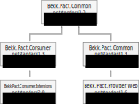

Pact for dotnet core
====================

This is a tool for running consumer driven test 
using the [Pact](https://docs.pact.io/) protocol.
This facilitates *consumers* of [micro-]services define their expectation of the service (the *provider*) in a contract. This contract is called a pact.

Read more about Pact at https://docs.pact.io/ and at the [Ruby implementation repo](https://github.com/realestate-com-au/pact).
The [specs are found here](https://github.com/pact-foundation/pact-specification).

This packet implements parts of the [version 1.0 of the spec](https://github.com/pact-foundation/pact-specification/tree/version-1). *Presntly, request body is not supported. Only Json response is supported.*

This implementation is agnostic of test framework, but I used [xUnit](https://xunit.github.io/) and [NUnit](http://nunit.org/) when developing and testing.

You will probably want to host a [Pact Broker](https://github.com/pact-foundation/pact_broker) to simplify the
transfer of pacts between the consumers and the provider. I suggest using [the docker container](https://github.com/DiUS/pact_broker-docker).

## Packages
This implementation concists of five nuget packages.


### Bekk.Pact.Common
This package contains mostly base classes and interfaces.
It is referenced from the other packages.
### Bekk.Pact.Consumer
This package enables creating consumer tests. 
The consumer defines the pact by specifying
a service request and a expected reply. and publishes the pact when it is asserted.
### Bekk.Pact.Consumer.Extensions
A package with some extension methods available in 
dotnet standard 2.0.
### Bekk.Pact.Provider
This package enables creating provider test.
The provider fetches the pacts and verifies them by replaying the
requests and comparing the result.
### Bekk.Pact.Provider.Web
This package provides tools to make it easier to setup a provider test and verifying the pacts.

## Consumer tests
The consumer tests defines the pacts and it's interactions.

This is done by using the `PactBuilder`and populate it in a fluent-ish fashion.
```C#
using Bekk.Pact;
```
